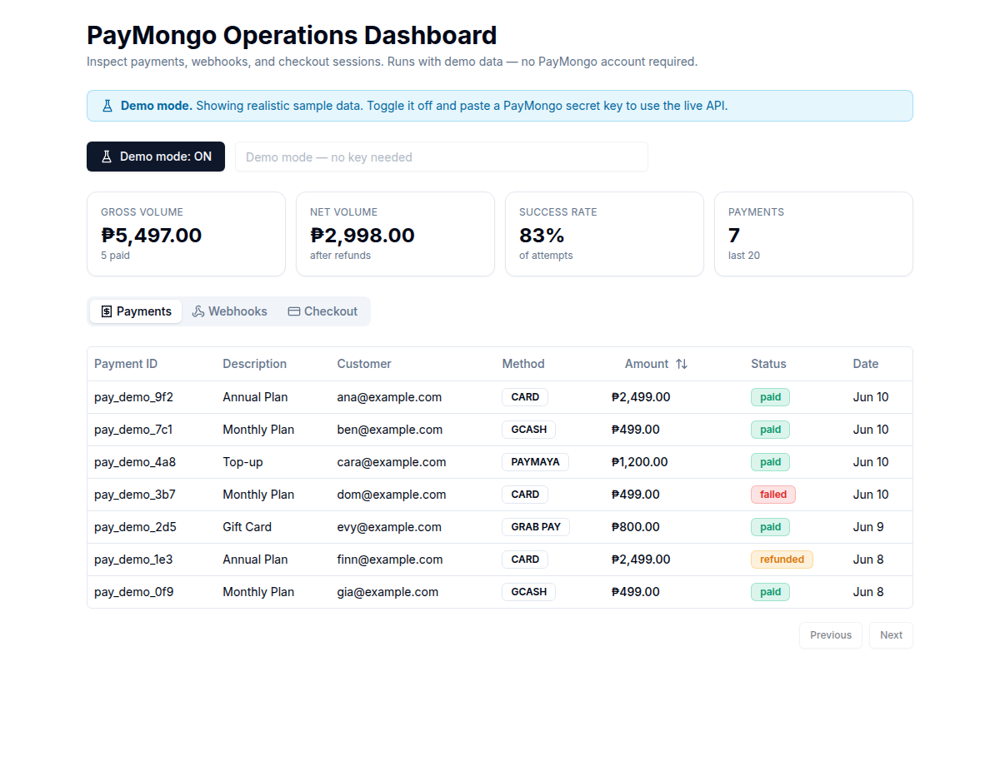
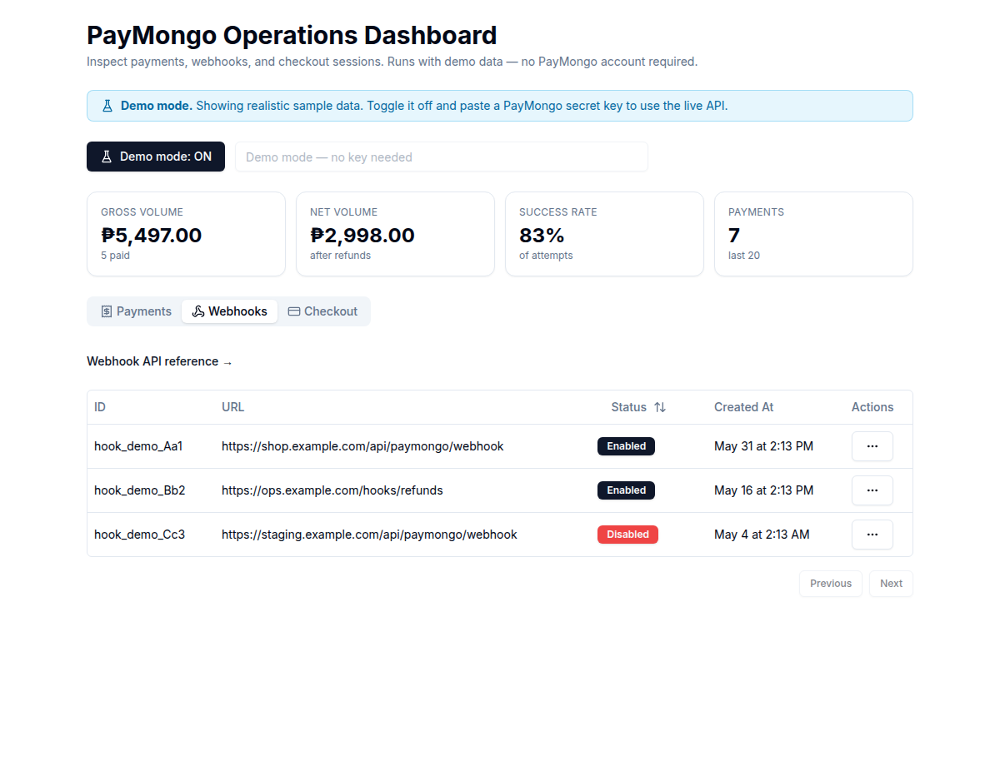

# PayMongo Operations Dashboard 💳

[](LICENSE)


A dashboard for **PayMongo** payment operations — inspect payments, webhooks,
and checkout sessions. It ships with a **demo mode that needs no PayMongo
account**, so anyone can clone it and explore the full UI immediately. Paste a
real secret key to switch to the live API.

## Why this exists

The original tool only did something if you pasted a real PayMongo secret key —
so a recruiter, teammate, or anyone evaluating it saw an empty screen. This
version runs on realistic mock data out of the box and grows into a small
operations dashboard: summary KPIs, a payments table, webhook inspection, and
test checkout sessions.

## Screenshots

| Operations dashboard (demo data) | Webhooks |
| --- | --- |
|  |  |

## Features

- **Demo mode (default on)** — realistic mock payments, webhooks, and a checkout
  session, served by the app's own API routes. No key, no account, works offline.
- **Live mode** — toggle demo off and paste a `sk_...` secret key; the same API
  routes proxy the real PayMongo API (the key stays server-side, never in the
  browser bundle).
- **Summary KPIs** — gross/net volume, success rate, and payment count, computed
  from the payments list.
- **Payments table** — sortable amounts, method + status badges, customer/date.
- **Webhooks** — list and (in live mode) enable/disable.
- **Checkout sessions** — create a test session and open its checkout URL.

## Architecture

```
Browser (zustand store)
   │  POST { secretKey }            secretKey empty/"demo" => demo data
   ▼
Next.js API routes  ── demo? ──►  lib/demo.ts  (mock data + summarize())
   /api/payments      │
   /api/webhooks      └─ live ──►  PayMongo REST API  (server-side, key never
   /api/checkout-sessions                              exposed to the client)
```

`lib/demo.ts` holds the mock dataset and a pure `summarize()` function (unit
tested). Demo mode is detected server-side via `isDemo(secretKey)`.

## Run it

### npm

```bash
npm install
npm run dev          # http://localhost:3000  (demo mode by default)
```

### Docker

```bash
docker compose up --build                       # dev
docker compose -f compose.prod.yaml up --build  # production-like
```

No environment file is required for demo mode. For live mode, paste your
PayMongo **test** secret key into the UI (it is sent to the local API routes,
not stored).

## Develop & verify

```bash
npm run lint     # next lint
npm test         # vitest — summary math + demo-mode detection
npm run build    # next build (type-check + production build)
```

## Project structure

```
app/(root)/(routes)/page.tsx   dashboard UI (KPIs + tabs)
app/api/                       payments / webhooks / checkout-sessions routes
lib/demo.ts                    mock data + summarize() (demo mode)
lib/paymongo.ts                live PayMongo request helpers
lib/format.ts                  currency / date formatting
hooks/use-paymongo.ts          zustand store (demo toggle, fetching)
components/data-tables/        payments + webhooks tables
docs/                          case study, screenshots
```

See [`docs/CASE_STUDY.md`](docs/CASE_STUDY.md) for the design story.

## Limitations & roadmap

- Demo data is static sample data; live mode reads real payments/webhooks.
- No persistence of its own — it's a read/inspect tool over PayMongo.
- Possible next steps: webhook event log viewer, refund/void actions in live
  mode, date-range filters, CSV export.

## License

[MIT](LICENSE)
